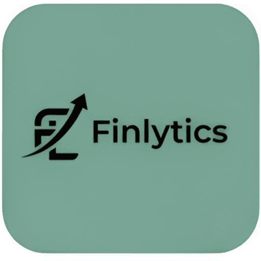

# FinLytics: Intelligent Financial Assistant

### **Introduction**

FinLytics is a smart personal finance assistant that combines finance and analytics to help users track their income, expenses, subscriptions, and savings efficiently.
Built as a full-stack Electron desktop application, FinLytics uses machine learning to forecast spending trends, provide adaptive saving suggestions, and guide users in affordability decisions such as EMI vs full payments.

Key Features

- Transaction Management: Record and categorize all income, expenses, and subscriptions in one place.
- Expense Categorization (ML): Automatically classify transactions using a trained ML model.
- Spending Forecast: Predict upcoming monthly expenses based on past patterns.
- Smart Saving Advisor: Suggest monthly saving targets and advise when to spend or save more.
- Affordability Checker: Recommend whether the user can buy on EMI or full payment based on income and savings.
- Data Visualization: Interactive charts and dashboards for financial insights.
- Cross-Platform Desktop App: Runs smoothly on Windows, macOS, and Linux through Electron.
- Offline Capability: Uses local database (SQLite) for privacy and performance.

---

### **Tech Stack**

Frontend:

- Electron.js
- HTML, CSS, JavaScript (React recommended for UI)
- Chart.js / Recharts for data visualization

Backend:

- Node.js with Express.js
- RESTful APIs for client-server communication

Machine Learning Layer:

- Python (scikit-learn, Prophet/ARIMA, XGBoost)
- Flask/FastAPI microservice for ML model predictions

Database:

- SQLite (local, default storage)

Example Key Functions

- Add, edit, delete, and categorize transactions
- View income, expenses, and savings summary
- Predict next month’s spending
- Check if an EMI purchase is affordable
- Get adaptive saving tips (increase, maintain, or lenient month)
- Visualize data through charts and graphs

---

  
## Download

Access the app:

---

### **Contributing**

> Contributions are welcome! Please feel free to submit issues or pull requests.

---

### **License**

> This project is licensed under the MIT License — free to use, modify, and distribute with credit.
