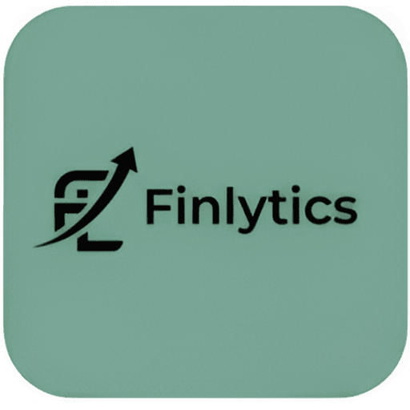

# FinLytics: Intelligent Financial Assistant

### **Introduction**

FinLytics is a smart personal finance assistant designed to help users track, analyze, and forecast their financial activities efficiently.

Built as a full-stack Electron desktop application, FinLytics integrates data analytics and a lightweight machine learning system to provide intelligent insights such as spending forecasts, saving recommendations, and affordability analysis.

The application is fully offline-capable and ensures user privacy by storing all data locally.

## Key Features

### 💰 Transaction Management

- Record and manage income, expenses, and subscriptions
- Categorize transactions for better financial tracking

### 🤖 Smart Categorization (ML-based)

- Automatically classifies transactions using a trained model

### 📊 Spending Forecast

- Predicts future income, expenses, and savings
- Uses a custom gradient boosting-based model with time-series features

### 🧠 Explainable Insights

- Provides feature-based explanations for predictions
- Helps users understand _why_ expenses may increase or decrease

### 💡 Smart Saving Advisor

- Suggests adaptive saving strategies:
  - Increase saving
  - Maintain balance
  - Relaxed spending months

### 🏦 Affordability Checker

- Recommends whether to:
  - Buy using EMI
  - Pay full amount
- Based on income stability and predicted expenses

### 📈 Data Visualization

- Interactive dashboards and charts
- Category-wise and monthly breakdowns

### 🖥️ Cross-Platform Desktop App

- Built with Electron
- Works on Windows, macOS, and Linux

### 🔒 Offline & Private

- Uses SQLite for local data storage
- No cloud dependency → full privacy

---

### **Tech Stack**

## Frontend:

- Electron.js
- HTML, CSS, JavaScript
- Chart.js (for visual analytics)

## Backend:

- Node.js
- Express.js

## Machine Learning Layer:

- Custom Gradient Boosting Model (JavaScript)
- Time-series feature engineering:
  - Momentum
  - Moving averages
  - Volatility
  - Seasonality
    > ⚠️ Note: This project uses a lightweight custom ML implementation optimized for offline performance.

## Database:

- SQLite (local storage)

---

## Core Functionalities

- Add, edit, and delete transactions
- Automatic expense categorization
- Monthly financial summaries
- Future expense and savings prediction
- EMI vs Full payment recommendation
- Smart saving suggestions
- Visual analytics dashboard

---

## Future Improvements

- Advanced ML integration (XGBoost / LSTM)
- Real Explainable AI (SHAP integration)
- Cloud sync & backup
- Mobile companion app
- Budget goal tracking system

---

  
## Download

Access the app:

---

### **Contributing**

Contributions are welcome!

- Fork the repository
- Create a feature branch
- Submit a pull request

---

### **License**

> This project is licensed under the **MIT License** — free to use, modify, and distribute with credit.
